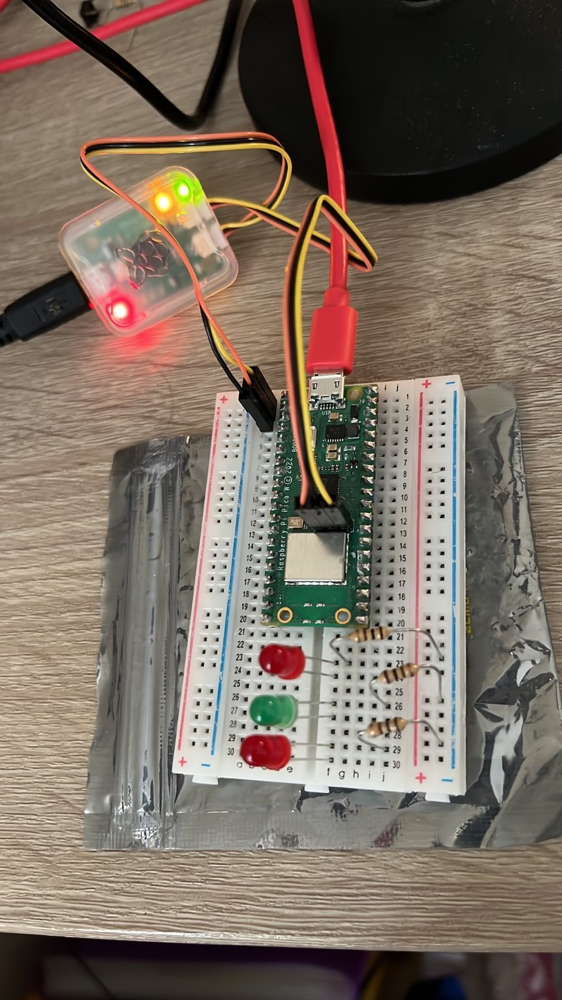

# From Zero to Blinky World

This documentation summarises the steps to set up development for the Raspberry Pi Pico W and Debug Probe on Ubuntu 22.04 LTS

## Software Pre-requisites

The following packages need to be installed:

```
sudo apt update
sudo apt install build-essential git micro
sudo apt install cmake gcc-arm-none-eabi 
sudo apt install libnewlib-arm-none-eabi 
sudo apt install libstdc++-arm-none-eabi-newlib
sudo apt install automake autoconf build-essential texinfo libtool libftdi-dev 
sudo apt install libusb-1.0-0-dev
sudo apt install python3-dev python3-pip
sudo apt install gdb-multiarch
```


## Hardware setup:

Both the Pico W and debug probe are connected to the host PC using USB.




# 1. Set up Pico SDK and Related Tools

The official documentation puts all pico code in a folder call `pico`

```
cd ~/
mkdir pico
cd pico
```

I use my `git` folder. It is entirely optional of course. Within this folder, there are a few repositories that need to be pulled down:

```
git clone https://github.com/raspberrypi/pico-sdk.git --branch master
cd pico-sdk
git submodule update --init
cd ..
git clone https://github.com/raspberrypi/pico-examples.git --branch master
git clone https://github.com/raspberrypi/pico-project-generator
git clone https://github.com/raspberrypi/picotool.git --branch master
git clone https://github.com/raspberrypi/openocd.git --branch rp2040 --recursive --depth=1
```

To build the forked version of `openocd` (supports Pico dual-core), do the following:

```
cd ~/pico
cd openocd
./bootstrap
./configure --enable-ftdi --enable-sysfsgpio --enable-bcm2835gpio
make -j4
sudo make install
cd ..
```

To build `picotool`, do the following:

```
cd ~/pico
cd picotool
mkdir build
cd build
cmake ..
make -j4
sudo make install
cd ..
```


## Modifications for Pico W

To avoid repetitive command line switches, the following changes are suggested:

### CMakeLists
All the examples in the pico-examples repository are built using a top level file `CMakeLists.txt` file. You can add some additional variables to this file so that it builds for the Pico W and supports debugging.

```
cd ~/pico
cd pico-examples
micro CMakeLists.txt
```

Under the line that reads `cmake_minimum_required(VERSION 3.12)` paste in the following (the micro editor uses ctrl-v for paste) and edit the WiFi strings accordingly:

```
set(PICO_BOARD pico_w)
set(CMAKE_BUILD_TYPE Debug)
set(WIFI_SSID "<WIFI Network Name>")
set(WIFI_PASSWORD "<wifi password>")
```

Now press ctrl-S to save and ctrl-q to quit.

## Set `PICO_SDK_PATH`

Once again, so save a lot of typing (and typos!) you should set the `PICO_SDK_PATH` in your bash profile. Each time you open a terminal, this will be set.

You can do this by typing the following (only do this once!):

```
echo "export PICO_SDK_PATH=$HOME/pico/pico-sdk" >> ~/.bashrc
```

## UDEV Permissions

The pico probe is a USB device that requires sudo (or root) privileges to access. This again can be problematic when performing debugging. To give all users access to this device, so the following:

```
sudo micro /etc/udev/rules.d/50-pico-debug-probe.rules 
```

Paste the following:

```
# Pico Debug Probe
SUBSYSTEM=="usb", ATTRS{idVendor}=="2e8a", ATTRS{idProduct}=="000c", MODE="666", GROUP="plugdev"
```

> You might want to check the vendor and product IDs are correct
>
> `lsusb | grep -i raspberry`
> 
> Check the ID. It is in the format vendor:product

Now either reboot, or type the following:

```
sudo udevadm control --reload
sudo udevadm trigger
```

## Build and Run the Examples

To build all examples, you now simply need to perform the following:

```
cd ~/pico
cd pico-examples
rm -rf build && mkdir build
cd build
cmake ..
make -j4
ls
```

Staying in this `build` folder, we see all the subfolders containing corresponding makefiles for each example. For example, let's build the pico_w version of blinky:

```
cd ~/pico/pico-examples/build/pico_w/wifi/blink
make -j4
ls
```

You should see both `picow_blink.elf` (for debugging) and `picow_blink.uf2` (for drag-drop programming)

### Run the Code - drag and drop

* Disconnect the usb cable to the pico_w
* Hold the button and reconnect. The pico_w will mount as a mass storage device (much like a USB stick).
* Drag `picow_blink.uf2` into the windows that pops up


To see cause and effect, let's change the blink rate. The source files are in a different tree:

```
micro ~/pico/pico-examples/pico_w/wifi/blink/picow_blink.c
```

Again, ctrl-s to save and ctrl-q to quit. Try changing the delay, and re-build with `make -j4`

Now deploy again to see the change!

### Run the code - debug probe

The drag-drop method is tedious, and will cause wear on the connectors. Better is to use the debug probe:

```
sudo openocd -f interface/cmsis-dap.cfg -f target/rp2040.cfg -c "adapter speed 5000" -c "program picow_blink.elf verify reset exit"
```

If you changed the [UDEV permissions](#udev-permissions), then you can drop `sudo` (yipee :). It is possible this might help integrating debug into an IDE (to be proven)


### Debug the Code in a Terminal (using the pico debugger)

It is useful to be able to single step code, set breakpoints and inspect variables. Of course, an IDE should make this a relatively seamless experience (assuming you can set one up). However, it is useful to see it in action at command line level.

First open **an additional** terminal and run the following command.

```
cd ~/pico/pico-examples/build/pico_w/wifi/blink
sudo /usr/local/bin/openocd -f interface/cmsis-dap.cfg -f target/rp2040.cfg -c "adapter speed 5000"
```

Again, you might be able to drop the `sudo`. You can leave this running for the duration of your development session.

From a different terminal, you can now run the following:

```
cd ~/pico/pico-examples/build/pico_w/wifi/blink
gdb-multiarch picow_blink.elf
```

Connect to the debugger (listening on port 3333)

```
(gdb) target remote localhost:3333
```

Load code into flash

```
(gdb) load
```

Now set a breakpoint in main and start it running

```
(gdb) monitor reset init
(gdb) b main
(gdb) continue
```


### Debug the Code in Visual Studio Code


## Update the SDK

On occasion, you might want to pull any updated to the SDK

```
cd pico-sdk
git pull
git submodule update
```

